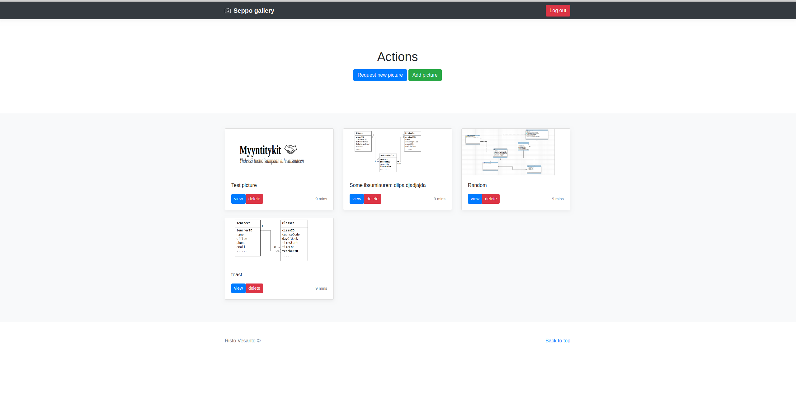

# Photo album
#### Status: Beta
#### Tools: Python, Django, SQL
Up: vesanto.dev

### Description:
Photo album where admin can add photos. A normal user with a password can see the pictures and request a new picture.

Every picture has name and description fields.

### Functionality:
Add, delete, update pictures. 
Email notification when a picture is requested. 
Working on apache server.

Login

Pictures

Picture

